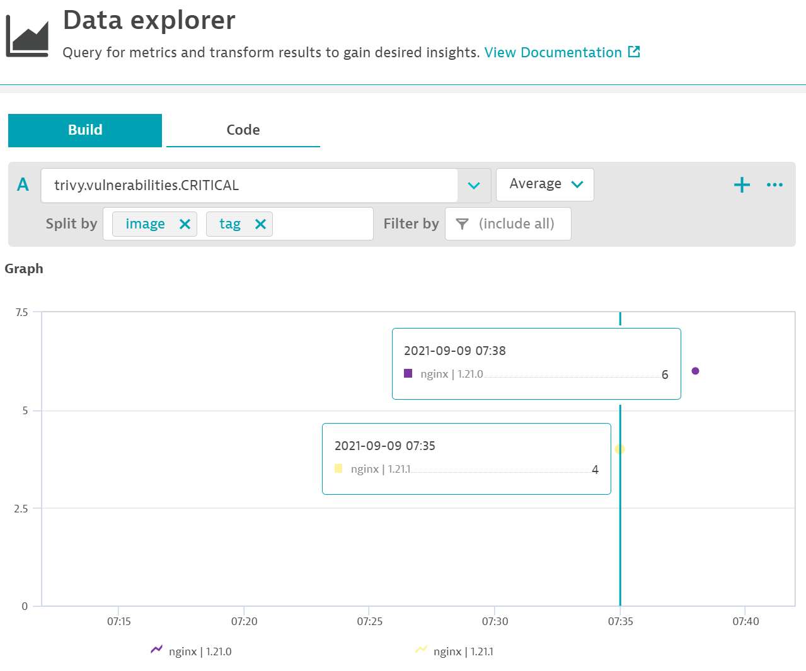

# Work and experiments with [Aquasecurity Trivy](https://github.com/aquasecurity/trivy)



1. :white_check_mark: Evaluate vulnerabilities in an image and push metrics into Dynatrace
2. Use above metrics in a quality gate evaluation

# Prereqs

- Ability to run Docker OR Python3 and `requests` installed: `pip3 install requests`
- A Dynatrace tenant
- A Dynatrace API Token with `Ingest Metrics` permissions

# Usage

## tldr: Working example

```
docker run --rm \
-e TRIVY_SECURITY=CRITICAL \
-e IMAGE=nginx \
-e TAG=1.21.1 \
-e METRICS_ENDPOINT=https://abc123.live.dynatrace.com \
-e METRICS_API_TOKEN=dt0c01.*** adamgardnerdt/trivy:v1
```

OR 

```
TRIVY_SECURITY=CRITICAL
IMAGE=nginx
TAG=1.21.1
METRICS_ENDPOINT=https://***.live.dynatrace.com
METRICS_API_TOKEN=dtc01.***
python3 app.py
```

The following environment variables are required:

- `TRIVY_SECURITY` matches the `--severity` flag [here](https://github.com/aquasecurity/trivy/blob/main/docs/getting-started/cli/config.md) and allows you to specify (in caps) the vulnerability levels you wish to retrieve. This is case sensitive. **You must use ALL CAPS**.

If not set, this will default to ALL security levels.

For example:
```
export TRIVY_SECURITY=HIGH,CRITICAL
```
- `IMAGE` is the docker hub image you wish to check.

For example:
```
export IMAGE=nginx
```

- `TAG` is the image tag value you wish to check.

For example:
```
export TAG=1.21.1
```

- `METRICS_ENDPOINT` is the endpoint of your metrics provider. Currently only Dynatrace is supported. **Remove all trailing slashes!**

For example:

```
export METRICS_ENDPOINT=https://abc123.live.dynatrace.com
```

- `METRICS_API_TOKEN` is the authentication token to push metrics. Currently only Dynatrace is supported.

```
export METRICS_API_TOKEN=dtc01.***
```
